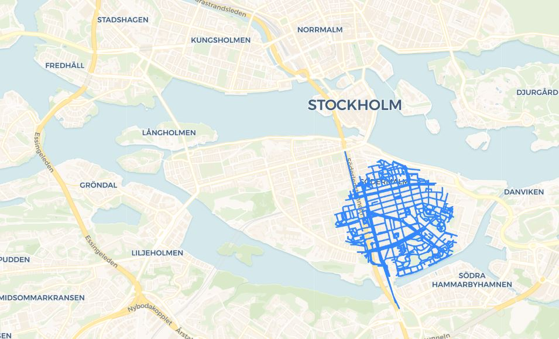
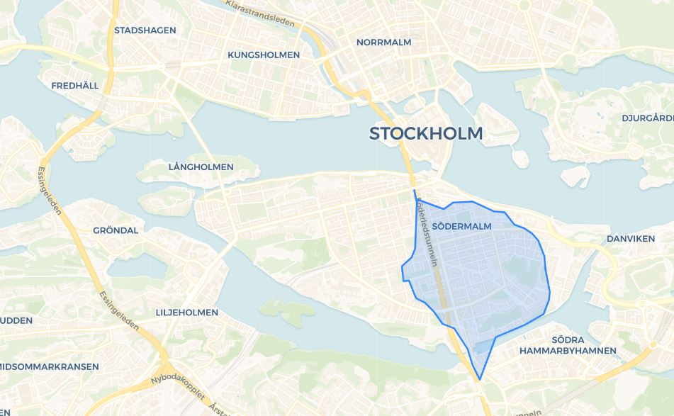

# pgrouting
## Create a road network database (pgrouting) using open-source data and software on Windows
<p align="justify">
In this tutorial we will set up a fully functional, fully open source, road network database. The database could for example be used for shortest path analysis (Dijkstra’s) or to create drive-time areas (Isochrones).
</p>


<h5 align="center">Example of a drive-time analysis conducted using pgrouting (5 min and 10 min walking distance):</h5>
<p align="center">

</p>

<p align="justify">
This tutorial does not intend to give an extensive guide to install and setup each software as there are many flavours to that and much better tutorials existing (some of which are linked to in this tutorial). Instead, it aims to fill the gap of going from A to B of enabling analysis on road data in a fully open-source way, available for anyone.
</p>

### Setup
#### Start by installing PostgreSQL and pgAdmin (if you don’t have it already).
Tutorials for installing PostgreSQL and pgAdmin can for example be found [here](https://www.postgresqltutorial.com/install-postgresql/).

#### Create your database using psql terminal
<p align="justify">
When you have installed PostgreSQL it is time to set up your database with its required extensions for road data. Pgrouting is the extension which enables setting up a road network database (you can read more about this <a href="https://pgrouting.org/">here</a>. In turn Pgrouting makes use of another extension called PostGIS. PostGIS is an extension for PostgreSQL for spatial data structures (you can read more about this <a href="https://postgis.net/">here</a>.
</p>

##### In psql terminal:
```shell
CREATE DATABASE city_routing; ^
connect city_routing;
CREATE EXTENSION pgrouting CASCADE;
```
[This tutorial](https://live.osgeo.org/en/quickstart/pgrouting_quickstart.html) explains the steps taken to set up and verify the pgrouting database in more detail.

### OpenStreetMap road network
#### Download OpenStreetMap
<p align="justify">
There are several ways to download OSM data, you can read more about it <a href="https://wiki.openstreetmap.org/wiki/Downloading_data">here</a>. For this tutorial, I’ve used <a href="https://www.geofabrik.de/">Geofabrik</a> as the source for downloading OSM data as they provide an easy distribution of it. I downloaded the road network of entire Sweden <a href="https://download.geofabrik.de/europe/sweden.html">here</a> as <b><i>Sweden-latest.osm.bz2</i></b>. Be aware that the files can be rather large (the zipped file of Sweden is 1GB and unzipped it is 11GB). Unzip the <b><i>.bz2</b></i> file using <a href="https://www.7-zip.org/">7-zip</a> or any other compatible software.
</p>

#### Prepare the data
<p align="justify">
In this tutorial I’ve used osm2pgrouting as the tool to load the data into the database (It will be further explained later). osm2pgrouting is quick but loads all data into memory which may result in OOM Error if your dataset is too big. There are alternative tools to use such as <b><i>osm2pgsql</i></b> or <b><i>osm2po</i></b> to bypass this issue. I decided to limit my dataset to Sweden’s capital city, Stockholm, so before loading the dataset I clipped it.
</p>

<p align="justify">
For this, <b><i>Osmosis</b></i> software was used, installation and configuration can be found <a href="https://wiki.openstreetmap.org/wiki/Osmosis#Downloading">here</a>. You need to either add Osmosis to your environmental variables or run the command from the bin folder of Osmosis (In my case I cd to <i>C:\YourPath\osmosis-0.48.3\bin</i>). To read more about Osmosis go <a href="https://wiki.openstreetmap.org/wiki/Osmosis/Detailed_Usage_0.48">here</a>.
</p>
        

##### Osmosis command for clipping using a bounding box:
```shell
osmosis --read-xml C:\YourPath\sweden-latest.osm --bb left=17.9563 right=18.1481 ^
top=59.3584 bottom=59.286 completeWays=yes --write-xml stockholm.osm
```
<p align="justify">
If you would like to clip the dataset using a custom polygon you would have to convert it to a .POLY file, you can read more about this <a href="https://wiki.openstreetmap.org/wiki/Osmosis/Polygon_Filter_File_Format">here</a>. If you are familiar with Python, you could use <a href="https://gist.github.com/sebhoerl/9a19135ffeeaede9f0abd4cdfedea3bc">this function</a>.
</p>

##### Osmosis command for clipping using a polygon (this .poly file was generated using the Python function above):
```shell
osmosis --read-xml C:\YourPath\sweden-latest.osm --bounding-polygon file=stockholm.poly ^
        completeWays=yes --write-xml stockholm.osm
```

After this a new .osm file have been produced which covers your area of interest. Now its time to push the data into your pgrouting database.

#### osm2pgrouting
Cd (change directory) in your command prompt to the directory of your .osm file or write out the entire path under the -f statement.

##### osm2pgrouting command:
```shell
osm2pgrouting ^
-c "C:\Program Files\PostgreSQL\13\bin\mapconfig.xml" ^
-f stockholm.osm ^
-d city_routing ^
-U postgres ^
-W YourPassWord ^
    --clean
```

Now you should have your very own pgrouting database, lets test it!

Open pgAdmin and run the following queries

##### Query to test shortest distance using Dijkstra’s algorithm on two coordinates:
```sql
with source_tmp AS (SELECT source 
            FROM ways 
            ORDER BY st_distance(the_geom, 
                ST_SetSRID(ST_MakePoint(18.01476, 59.32903), 4326)) limit 1),
     target_tmp AS (SELECT target 
            FROM ways 
            ORDER BY st_distance(the_geom, 
                ST_SetSRID(ST_MakePoint(18.0833, 59.3108), 4326)) limit 1)

SELECT * 
FROM pgr_dijkstra('SELECT gid AS id
                  , source
                  , target
                  , cost
                  , reverse_cost 
                  FROM ways'
                  , (SELECT source from source_tmp) 
                  , (SELECT target from target_tmp), true) AS r 
LEFT JOIN ways AS w 
ON r.edge = w.gid;
```

<h5 align="center">Expected output:</h5>
<p align="center">

</p>
        
##### Query to select the roads reachable of 15-minute walking distance (900 seconds):
```sql
SELECT 'Nytorget' AS name,
        15 AS drive_time,
        ST_Collect(ways.the_geom) AS the_geom 
        FROM ways
    JOIN (SELECT * FROM pgr_drivingDistance(
        'SELECT gid AS id
        , source
        , target
        , length_m AS cost 
        FROM "ways"      '
        ,53588,900,FALSE)
) AS route 
  ON ways.target = route.node
```

##### Query to create isochrone of 15-minute walking distance (900 seconds):
```sql
SELECT 'Nytorget' AS name,
        15 AS drive_time,
        ST_CollectionExtract(ST_ConcaveHull(ST_Collect(ways.the_geom), 0.99),3) AS the_geom
        FROM ways
    JOIN (SELECT * FROM pgr_drivingDistance(
        'SELECT gid AS id
        , source
        , target
        , length_m AS cost 
        FROM "ways"      '
        ,53588,900,FALSE)
) AS route 
  ON ways.target = route.node
```

<h5 align="center">Expected output:</h5>
<p align="center">
 
</p>
